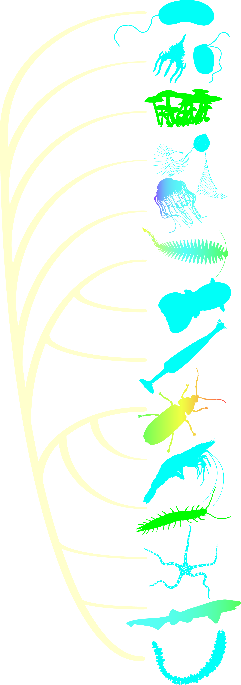

<figure style="float:left">

    <figcaption style="text-align: center;">Bioluminescence over the tree of life. The colors represent the 
    luminescence colors that the animals produce</figcaption>
</figure>

Bioluminescence is key ecological trait in thousands of terrestrial
and marine species spread through the tree of life. By studying
bioluminescent animals, we can simultaneously learn about the
evolutionary history of these animals, their behavior, their ecology,
and novel biochemical systems that can be harnessed as tools for
biomedical research.

Our mission is to answer the questions above by sequencing the genomes
of luminous and closely-related nonluminous animals.

To do so, the Genomes of Luminous Organisms (GLO) Consortium has
joined together to pool sample collection, _de novo_ genome assembly
and annotation, as well as investigation of novel chemistries.
