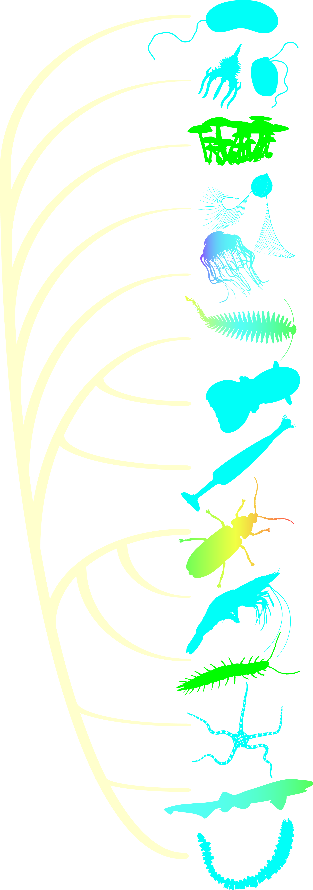

---
title:
layout: article
permalink: /species/
share: false
---

New for Tuesday

    <figure>
        

            
        

        <!-- These are the hover boxes for the left panel that activate the middle panels -->
        

        

        

        

        

        

        

        

        

        

        

        

        

        

        <!-- This div is the items in the middle and right panels -->
        

            <!-- Place all the middle panels in a MiddleOption class -->
            <!--   with a specific ID with <taxon>Panel nomenclature -->
            

                

                

                
            

            

                
            

            

                
            

            <!-- These are all of the possible right panels -->
            

                
                
            

        

    </figure>

